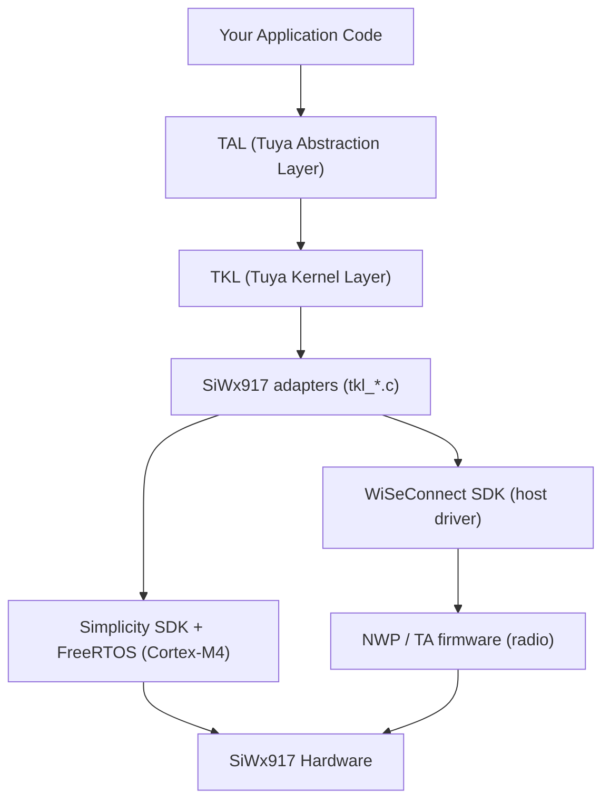

TuyaOpen runs the Silicon Labs SiWx917 on top of Silicon Labs' own WiSeConnect SDK, Simplicity SDK, and FreeRTOS, so you build IoT and AI applications on SiWx917 hardware with the same TuyaOpen SDK and APIs you use on Tuya T-series, ESP32, Linux, and other supported platforms.

## Why use TuyaOpen on SiWx917

If you already develop on SiWx917, TuyaOpen gives you:

- **Tuya Cloud integration**: Device activation, remote control, OTA, and data points (DP) out of the box, without writing your own cloud stack.
- **Cross-platform portability**: Write application code once against TuyaOpen's TAL/TKL abstraction. The same app logic runs on T5AI, T2, T3, ESP32, Raspberry Pi, and SiWx917 without rewrites.
- **AI capabilities**: Access Tuya's AI Agent, voice interaction (ASR/TTS/KWS), and LLM services through the unified AI SDK. The AI dev kit is built for exactly this — a chat button, an analog microphone and speaker, and a display.
- **Production-ready path**: Device authorization, license key management, OTA firmware updates, and Tuya Smart app pairing are built in, from prototype to mass production.
- **Peripheral library**: Reusable display, audio, button, and LED drivers with board-level configuration.

## The chip: two processors

The SiWx917 (SiWG917) is a Wi-Fi 6 + Bluetooth LE SoC with two processors that matter to how you flash and debug it:

| Processor | Runs | Firmware |
|-----------|------|----------|
| Cortex-M4 | Your application, FreeRTOS, lwIP, all TuyaOpen code | Built from your app (`tos.py build`), flashed with every update |
| NWP (network wireless processor) | Wi-Fi and BLE stacks, the radio | TA firmware (`RS9117_WC_SI.rps`), flashed once per device — boards normally arrive with it programmed |

The M4 application cannot start without the TA firmware. `tos.py flash` checks the device's TA version and offers to write it only when needed; see [Quick Start](siwx917-quick-start#5-flash-the-firmware).



## Relationship with the Silicon Labs SDKs

TuyaOpen on SiWx917 builds on top of the vendor SDKs, not as a replacement for them:

- **Simplicity SDK** provides CMSIS, the peripheral drivers (GPIO, GSPI, ADC, PWM, RTC, UART), and the FreeRTOS port. TKL adapters (`tkl_gpio.c`, `tkl_spi.c`, and others) translate TuyaOpen's portable API calls into these drivers.
- **WiSeConnect SDK** provides the host driver that talks to the NWP, plus the TA firmware image itself. Wi-Fi and BLE go through it.
- **Silicon Labs SLC and Simplicity Commander** are build and flash tools, fetched automatically by the platform bootstrap into `platform/SIWX917/tools/` — nothing is installed into your system.

| Need | Use | Why |
|------|-----|-----|
| Wi-Fi, BLE, GPIO, UART, SPI, I2C, PWM, ADC, RTC | TuyaOpen TKL/TAL APIs | Cross-platform, consistent API |
| Tuya Cloud, device management, OTA, DP | TuyaOpen cloud service | Required for Tuya ecosystem |
| AI (ASR, TTS, LLM, MCP) | TuyaOpen AI SDK | Integrated with Tuya AI Agent |
| Display (ST7789) and audio drivers | `boards/SIWX917/common/` BSP | Board-level, calls the peripheral drivers |
| Wi-Fi performance profiles, power manager, radio statistics | WiSeConnect `sl_wifi_*` / `sl_power_manager_*` directly | Not abstracted by TuyaOpen |

## The platform layer and the first build

Each TuyaOpen platform lives in its own directory under `platform/`, fetched as a separate git repository per `platform/platform_config.yaml`. The SiWx917 one (`platform/SIWX917/`) builds differently from the T5AI platform in ways worth knowing before your first build.

### What's in `platform/SIWX917/`

| Path | What it is |
|------|------------|
| `tuyaos_adapter/` | The TKL adapters (`tkl_*.c`) — translate TuyaOpen's portable API into Simplicity SDK peripheral drivers and the WiSeConnect host driver |
| `mcu/` | Chip-level code and the vendor patches (e.g. the WiSeConnect patch, the MP3 internal-RAM pool) |
| `sdks/` | Vendor SDKs, cloned on first build: `simplicity_sdk/`, `wiseconnect/` |
| `slc/`, `tuyaopen-si91x.slsdk`, `script/generate`, `build_setup.py` | The Silicon Labs SLC project description and the step that turns it into CMake/sources before anything compiles (`build_kconfig2slcp.py` writes Kconfig into the `.slcp`) |
| `tools/` | Silicon Labs SLC CLI and Simplicity Commander, installed on first build |
| `script/bootstrap` | Installs the ARM toolchain, a Java runtime (the SiLabs tools are Java applications), and the SiLabs tools |
| `platform_libsdepend` | The vendor-SDK manifest: which repositories, which versions, which patch |
| `platform_prepare.py` | Runs on first build and pulls everything listed below |
| `platform_flash_bridge.py` | What `tos.py flash` drives — Commander over J-Link, or the ISP serial path |
| `toolchain_file.cmake` | Locates the shared ARM GNU toolchain under `platform/tools/` |
| `GETTING_STARTED.md` | The platform's own documentation, including the deep-recovery procedures |

### How the build differs from T5AI

- **An extra code-generation layer.** Before anything compiles, `build_setup.py` calls `script/generate`, and the SLC CLI turns the `.slcp`/`.slce` project description into CMake and headers. The T5AI platform compiles its vendor SDK sources directly. Pitfalls are in [SLC code generation](#slc-code-generation-and-build-notes) below.
- **Vendor SDKs come from a manifest.** `platform_prepare.py` reads `platform_libsdepend` and clones Simplicity SDK and WiSeConnect at pinned versions, applying a patch to WiSeConnect. T5AI's vendor SDK (`t5_os`) ships inside its platform repository.
- **Same compiler, shared location.** Both platforms build with GNU Arm Embedded (`gcc-arm-none-eabi`); whichever platform builds first installs it into the shared `platform/tools/`, and the other reuses it.
- **Different artifacts and flash path.** A SiWx917 build produces `.elf`, a `.s37` flash image, and a QIO `.bin` (the full-flash image used for OTA), assembled by a Commander post-build step. Flashing goes over J-Link (SWD) or the ISP UART — not the serial-bootloader path T5AI uses.

### What the first build downloads

The first `tos.py build` runs `platform_prepare.py`, which fills everything inside `platform/SIWX917/` — nothing is installed system-wide.

| Pulled | Lands in | Size (Linux x64) |
|--------|----------|------------------|
| GNU Arm Embedded toolchain | `platform/tools/` (shared across platforms; skipped if already present) | ~700 MB |
| Java runtime (Temurin 21, required by the SiLabs tools) | `platform/SIWX917/tools/jre/` | — |
| SLC CLI | `tools/slc/` | ~500 MB |
| Simplicity Commander | `tools/commander/` | ~90 MB |
| Simplicity SDK v2025.6.1 (with submodules) | `sdks/simplicity_sdk/` | ~2.8 GB |
| WiSeConnect v4.0.0-ifc2fc + platform patch | `sdks/wiseconnect/` | ~560 MB |

Budget roughly 4–5 GB of disk, and expect most of the first-build wall time to be cloning Simplicity SDK.

## SLC code generation and build notes

`tos.py build` on SiWx917 does not compile first. The order is:

1. `platform_prepare.py` pulls the SDKs and tools from `platform_libsdepend` (skipped when they are already present).
2. `build_setup.py` runs `build_kconfig2slcp.py` to write the current `using.config` into the `.slcp` (UART / I2C and similar peripherals become SLC components).
3. `script/generate` invokes the SLC CLI: `slc generate --output-type=cmake`. The AI kit's `--with` is `siwx917_ai_dev_kit;tuyaopen-si91x`; BRD2605A's is `brd2605a;wiseconnect3_sdk`.
4. Output lands in the app's `.build/slc/` (CMake, autogen, RTE / pin headers, linker script). The platform then overwrites the linker with its PSRAM script and patches `MEMORY` for the chosen M4 flash size.
5. Only then do CMake and Ninja run.

`Trusting Simplicity SDK`, `Trusting extension`, `already trusted`, and SLF4J warnings during generate are normal and not the failure. When it does fail, the wrapper prints a single `Failed to generate <project>` — the cause is in the SLC / Java / Python output above that line.

:::warning[Regenerate after changing peripherals or the board]
If `.build/slc/` already exists, `script/generate` prints `Skipping generation` and exits. `kconfig2slcp` has already rewritten the `.slcp`, but SLC **does not** run again, so the new peripherals or board never enter the generated tree. After switching boards, changing UART / I2C / I2S Kconfig, or if the generated tree looks stale:

```bash
tos.py clean
tos.py build
```

Deleting `.build/slc/` and rebuilding is enough. Incremental builds are fast *because* they skip this step — do not take the skip as proof that your config change took effect.
:::

Other rules that actually bite:

- **Do not symlink `sdks/` across checkouts.** SLC canonicalizes the SDK path with `realpath` and requires the extensions (`tuyaopen-si91x`, `wiseconnect3_sdk`) to sit under that canonical root. A symlink to another tree's `sdks/` fails `signature trust` / `generate` because the extension path is then outside the SDK root.
- **Do not let PATH steal SLC.** `script/slc_cli` prefers `slc` / `slc-cli` from PATH over `platform/SIWX917/tools/slc/` when either is found. If Simplicity Studio is installed, check that `which slc` is not pointing at a different copy.
- **`No module named 'jinja2'` is not a missing pip package.** SLC loads a **bundled Python 3.10** through Java/JEP to render `.jinja` templates; jinja2 in TuyaOpen's `.venv` does not help. If the log also has `Feature lack: 'apack.core:4'`, the bundled Python adapter pack failed to load and JEP fell back to the wrong interpreter. Do not `pip install jinja2` into `.venv`.
- **Keep `source export.sh`; do not `deactivate`.** Platform scripts need `python` from `.venv`; SLC uses the bundled interpreter. Leaving the venv yields `python: not found`.
- **`No need prepare` but the build still fails.** `platform_prepare` only checks that `tools/toolchain` exists, not that `arm-none-eabi-gcc` is inside it. An interrupted download leaves an empty directory and every later run skips prepare. Delete that directory and `tos.py build` again.
- **Java is not a system install.** SLC is a Java program; the first build puts Temurin 21 in `tools/jre/`. A broken `JAVA_HOME` on the host can displace the bundled JRE.

## Supported boards

| Board | Module | Highlights |
|-------|--------|------------|
| `SIWX917_AI_DEV_KIT` | SiWG917M111MGTBA | Tuya AI dev kit: ST7789 320×240 SPI display, analog microphone + speaker (no external codec), chat button SW1, SW2/SW3 buttons, RGB LEDs |
| `BRD2605A` | SiWG917M | Silicon Labs dev kit; the on-board debugger exposes a J-Link VCOM, so logs and flashing work over one USB cable with no wiring |

## SiWx917 implementation notes

Behaviors specific to this platform you should know before you start:

- **BLE provisioning only**: SoftAP and BLE cannot coexist on this chip. The adapter enforces this itself — `tkl_wifi_start_ap()` returns `OPRT_NOT_SUPPORTED`, and an app requesting both BLE and SoftAP provisioning still provisions over BLE. No application edit is required.
- **Application log on the ULP UART**: `TUYA_UART_NUM_0` maps to the ULP UART at 115200 8N1. On the BRD2605A it lands on the J-Link VCOM; on the AI dev kit with an external probe, wire a USB-serial adapter to flat pins 75 (log out) and 73 (log in). Details in [Quick Start](siwx917-quick-start#6-open-the-log).
- **Code runs from PSRAM**: text, BSS, and the FreeRTOS heap are placed in the 8 MB in-package PSRAM. The chip's only QSPI controller is the PSRAM bus itself, so it is deliberately not exposed as a generic QSPI peripheral.
- **M4 flash region**: 2040 KB by default, 3008 KB optional. Changing the size requires an MBR update on the device — see [Quick Start](siwx917-quick-start#advanced-m4-flash-size).
- **Power management TKL APIs are stubs at the time of writing** (`tkl_sleep.c`, `tkl_wifi_set_lp_mode()`), so deep-sleep and Wi-Fi low-power modes are not yet available through TuyaOpen APIs.
- **Hardware AES**: GCM runs on the platform AES engine (`ENABLE_PLATFORM_AES`); a compile-time choice with no software fallback at runtime.
- **MP3 playback** uses a dedicated internal-RAM scratch pool on this platform, because decoding out of PSRAM stutters audibly.

## Next steps

- [SiWx917 Quick Start](siwx917-quick-start): Build, flash, and provision your first TuyaOpen project on the SIWX917_AI_DEV_KIT.
- [Bring Up New Hardware](../porting/bring-your-chip-to-tuyaopen): The general TuyaOpen porting guides.
