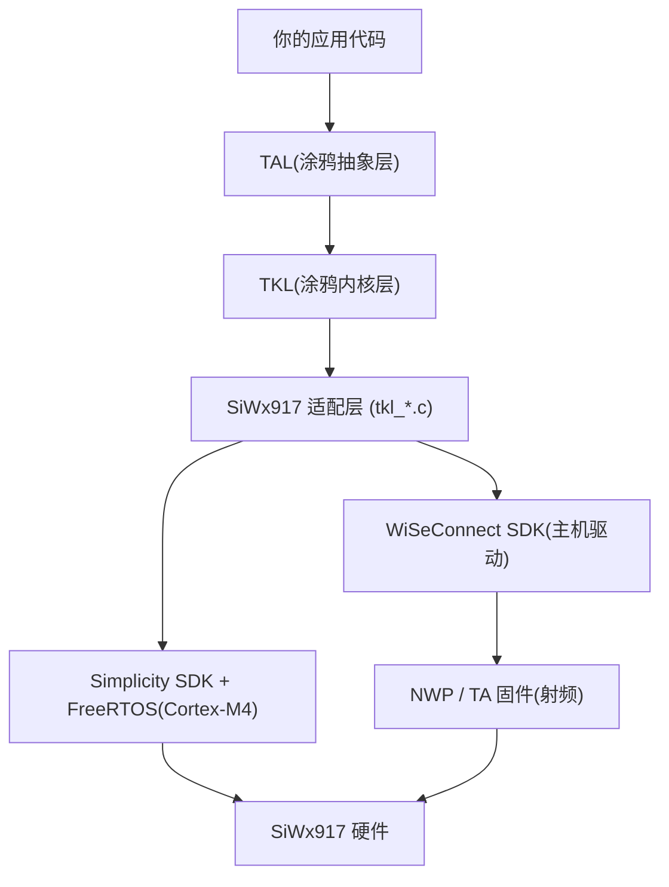

TuyaOpen 在 Silicon Labs 官方的 WiSeConnect SDK、Simplicity SDK 和 FreeRTOS 之上运行 SiWx917,你可以使用与 Tuya T 系列、ESP32、Linux 及其他支持平台相同的 TuyaOpen SDK 和 API,在 SiWx917 硬件上构建物联网和 AI 应用。

## 为什么在 SiWx917 上使用 TuyaOpen

如果你已经在 SiWx917 上开发,TuyaOpen 为你提供:

- **Tuya Cloud 集成**:开箱即用的设备激活、远程控制、OTA 和数据点 (DP),无需自行编写云端协议栈。
- **跨平台可移植性**:针对 TuyaOpen 的 TAL/TKL 抽象编写一次应用代码,同一逻辑即可运行在 T5AI、T2、T3、ESP32、Raspberry Pi 和 SiWx917 上,无需重写。
- **AI 能力**:通过统一 AI SDK 访问 Tuya AI Agent、语音交互 (ASR/TTS/KWS) 和 LLM 服务。AI 开发板正是为此设计——对话按键、模拟麦克风和喇叭、显示屏一应俱全。
- **产品化路径**:设备授权、license 管理、OTA 固件升级、涂鸦智能 App 配网全部内置,从原型到量产。
- **外设库**:显示、音频、按键、LED 驱动开箱即用,板级配置管理。

## 芯片:两个处理器

SiWx917 (SiWG917) 是一颗 Wi-Fi 6 + 蓝牙 LE SoC,内部有两个处理器,烧录和调试方式因此与众不同:

| 处理器 | 运行内容 | 固件 |
|--------|----------|------|
| Cortex-M4 | 你的应用、FreeRTOS、lwIP、全部 TuyaOpen 代码 | 由你的应用构建产出(`tos.py build`),每次更新都要烧录 |
| NWP(网络无线处理器) | Wi-Fi 和 BLE 协议栈、射频 | TA 固件(`RS9117_WC_SI.rps`),每台设备只需烧一次——板子出厂通常已烧好 |

M4 应用没有 TA 固件就无法启动。`tos.py flash` 会读取设备的 TA 版本,只在缺失时才提供烧写;详见[快速开始](siwx917-quick-start#5-烧录固件)。



## 与 Silicon Labs SDK 的关系

TuyaOpen 在 SiWx917 上构建于厂商 SDK 之上,而非取而代之:

- **Simplicity SDK** 提供 CMSIS、外设驱动(GPIO、GSPI、ADC、PWM、RTC、UART)和 FreeRTOS 移植层。TKL 适配层(`tkl_gpio.c`、`tkl_spi.c` 等)把 TuyaOpen 的跨平台 API 翻译成这些驱动调用。
- **WiSeConnect SDK** 提供与 NWP 通信的主机驱动,以及 TA 固件镜像本身。Wi-Fi 和 BLE 都经由它。
- **Silicon Labs SLC 和 Simplicity Commander** 是构建和烧录工具,由平台引导脚本自动下载到 `platform/SIWX917/tools/`——不会装进你的系统。

| 需求 | 用什么 | 原因 |
|------|--------|------|
| Wi-Fi、BLE、GPIO、UART、SPI、I2C、PWM、ADC、RTC | TuyaOpen TKL/TAL API | 跨平台、API 一致 |
| 涂鸦云、设备管理、OTA、DP | TuyaOpen 云服务 | 涂鸦生态必需 |
| AI(ASR、TTS、LLM、MCP) | TuyaOpen AI SDK | 与 Tuya AI Agent 集成 |
| 显示(ST7789)和音频驱动 | `boards/SIWX917/common/` BSP | 板级实现,调用外设驱动 |
| Wi-Fi 性能档位、功耗管理、射频统计 | 直接调用 WiSeConnect `sl_wifi_*` / `sl_power_manager_*` | TuyaOpen 未抽象这部分 |

## 平台层目录与首次构建

TuyaOpen 的每个平台在 `platform/` 下各占一个目录,按 `platform/platform_config.yaml` 作为独立 git 仓库获取。SiWx917 的这一层(`platform/SIWX917/`)在构建方式上和 T5AI 平台不一样,第一次编译前值得先了解。

### `platform/SIWX917/` 里有什么

| 路径 | 内容 |
|------|------|
| `tuyaos_adapter/` | TKL 适配层(`tkl_*.c`)——把 TuyaOpen 的跨平台 API 翻译成 Simplicity SDK 外设驱动和 WiSeConnect 主机驱动调用 |
| `mcu/` | 芯片级代码和厂商补丁(如 WiSeConnect 补丁、MP3 内部 RAM 暂存池) |
| `sdks/` | 厂商 SDK,首次构建时克隆:`simplicity_sdk/`、`wiseconnect/` |
| `slc/`、`tuyaopen-si91x.slsdk`、`script/generate`、`build_setup.py` | Silicon Labs SLC 工程描述,以及编译前把它生成 CMake/源码的步骤(`build_kconfig2slcp.py` 把 Kconfig 写进 `.slcp`) |
| `tools/` | Silicon Labs SLC CLI 和 Simplicity Commander,首次构建时安装 |
| `script/bootstrap` | 安装 ARM 工具链、Java 运行时(SiLabs 工具是 Java 程序)和 SiLabs 工具 |
| `platform_libsdepend` | 厂商 SDK 清单:哪些仓库、哪些版本、打什么补丁 |
| `platform_prepare.py` | 首次构建时运行,拉取下面列的所有东西 |
| `platform_flash_bridge.py` | `tos.py flash` 的执行入口——走 Commander + J-Link,或 ISP 串口 |
| `toolchain_file.cmake` | 在共享的 `platform/tools/` 下定位 ARM GNU 工具链 |
| `GETTING_STARTED.md` | 平台自带文档,含深度救砖流程 |

### 与 T5AI 构建路径的差异

- **多一层代码生成。** 编译任何源码之前,`build_setup.py` 调 `script/generate`,由 SLC CLI 从 `.slcp`/`.slce` 工程描述生成 CMake 和头文件。T5AI 平台直接编译厂商 SDK 源码,没有这一层。细节与踩坑见下文 [SLC 代码生成与编译注意事项](#slc-代码生成与编译注意事项)。
- **厂商 SDK 来自清单。** `platform_prepare.py` 读 `platform_libsdepend`,按锁定版本克隆 Simplicity SDK 和 WiSeConnect,并给 WiSeConnect 打补丁。T5AI 的厂商 SDK(`t5_os`)随平台仓库一起分发。
- **同一套编译器,共享存放。** 两个平台都用 GNU Arm Embedded(`gcc-arm-none-eabi`);谁先构建谁把它装进共享的 `platform/tools/`,另一个直接复用。
- **产物和烧录通道不同。** SiWx917 构建产出 `.elf`、`.s37` 烧录镜像和 QIO `.bin`(OTA 用的整片镜像),由 Commander 的 post-build 步骤组装。烧录走 J-Link(SWD)或 ISP 串口——不是 T5AI 那种串口 bootloader 通道。

### 第一次构建会拉取什么

第一次 `tos.py build` 会运行 `platform_prepare.py`,所有东西都装在 `platform/SIWX917/` 内部——不进你的系统。

| 拉取内容 | 落在 | 体积(Linux x64 实测) |
|----------|------|------------------------|
| GNU Arm Embedded 工具链 | `platform/tools/`(各平台共享,已存在则跳过) | 约 700 MB |
| Java 运行时(Temurin 21,SiLabs 工具依赖) | `platform/SIWX917/tools/jre/` | — |
| SLC CLI | `tools/slc/` | 约 500 MB |
| Simplicity Commander | `tools/commander/` | 约 90 MB |
| Simplicity SDK v2025.6.1(含子模块) | `sdks/simplicity_sdk/` | 约 2.8 GB |
| WiSeConnect v4.0.0-ifc2fc + 平台补丁 | `sdks/wiseconnect/` | 约 560 MB |

预留 4–5 GB 磁盘;首次构建的大部分耗时花在克隆 Simplicity SDK 上。

## SLC 代码生成与编译注意事项

`tos.py build` 在 SiWx917 上不是直接开编,顺序是:

1. `platform_prepare.py` 按 `platform_libsdepend` 拉取 SDK 和工具(已齐则跳过)。
2. `build_setup.py` 用 `build_kconfig2slcp.py` 把当前 `using.config` 写进 `.slcp`(UART / I2C 等外设会变成 SLC 组件)。
3. `script/generate` 调用 SLC CLI:`slc generate --output-type=cmake`。AI 开发板的 `--with` 是 `siwx917_ai_dev_kit;tuyaopen-si91x`,BRD2605A 是 `brd2605a;wiseconnect3_sdk`。
4. 产物落在应用的 `.build/slc/`(cmake、autogen、RTE / pin 头文件、链接脚本)。平台再用自己的 PSRAM 链接脚本覆盖,并按 M4 flash 大小改 `MEMORY`。
5. 这之后才是 CMake + Ninja。

生成阶段日志里出现 `Trusting Simplicity SDK`、`Trusting extension`、`already trusted`、SLF4J 警告都是正常的,不是失败原因。真正失败时包装脚本只印一行 `Failed to generate <project>`,根因在它上面的 SLC / Java / Python 输出。

:::warning[改外设或换板后必须重生]
`script/generate` 发现 `.build/slc/` 已存在就会打印 `Skipping generation` 并退出。此时 `kconfig2slcp` 已经改过 `.slcp`,但 SLC **不会**再跑,新外设、新板型都进不了生成物。换板、改 UART / I2C / I2S 等 Kconfig、或怀疑生成物损坏时:

```bash
tos.py clean
tos.py build
```

只删 `.build/slc/` 再构建也可以。增量编译快,是因为跳过了这一步——不要把它当成“配置已经生效”。
:::

动手时还要注意这些:

- **不要给 `sdks/` 做跨树软链。** SLC 会把 SDK 路径 `realpath` 规范化,并要求 extension(`tuyaopen-si91x`、`wiseconnect3_sdk`)落在这个规范化根下面。把另一份 checkout 的 `sdks/` 软链过来,`signature trust` / `generate` 会因路径不在 SDK 根下而失败。
- **PATH 上不要抢 SLC。** `script/slc_cli` 若在 PATH 里找到 `slc` 或 `slc-cli`,会优先用系统那套,而不是 `platform/SIWX917/tools/slc/`。本机装过 Simplicity Studio 时,先确认 `which slc` 不会指到另一份。
- **`No module named 'jinja2'` 不是缺包。** SLC 用 Java/JEP 加载**自带的 Python 3.10** 渲染 `.jinja` 模板,TuyaOpen `.venv` 里的 jinja2 帮不上忙。日志里若同时有 `Feature lack: 'apack.core:4'`,是自带 Python adapter pack 没加载上,JEP 回退到了错误的解释器。不要对 `.venv` 再 `pip install jinja2`。
- **保持 `source export.sh`,不要 `deactivate`。** 平台脚本需要 `.venv` 里的 `python`;SLC 自己用捆绑解释器。退出 venv 会导致 `python: not found`。
- **`No need prepare` 但编不过。** `platform_prepare` 只检查 `tools/toolchain` 目录在不在,不检查里面有没有 `arm-none-eabi-gcc`。下载中断会留下空目录,以后每次都跳过准备。删掉该目录再 `tos.py build`。
- **Java 不用装进系统。** SLC 是 Java 程序,首次构建把 Temurin 21 装到 `tools/jre/`。若本机 `JAVA_HOME` 指向一套坏掉的 JDK,可能把捆绑 JRE 挤掉。

## 支持的开发板

| 开发板 | 模组 | 亮点 |
|--------|------|------|
| `SIWX917_AI_DEV_KIT` | SiWG917M111MGTBA | 涂鸦 AI 开发板:ST7789 320×240 SPI 显示屏、模拟麦克风 + 喇叭(无外置 codec)、对话按键 SW1、SW2/SW3 按键、RGB LED |
| `BRD2605A` | SiWG917M | Silicon Labs 开发板;板载调试器提供 J-Link VCOM,一根 USB 线即可完成烧录和看日志,无需额外接线 |

## SiWx917 实现说明

动手之前应当了解的平台特有行为:

- **仅支持 BLE 配网**:这颗芯片上 SoftAP 和 BLE 无法共存。适配层自己做了强制——`tkl_wifi_start_ap()` 返回 `OPRT_NOT_SUPPORTED`,应用即使同时请求 BLE 和 SoftAP 配网,实际也走 BLE,无需改应用代码。
- **应用日志走 ULP UART**:`TUYA_UART_NUM_0` 映射到 ULP UART,115200 8N1。BRD2605A 上日志落在板载 J-Link VCOM;AI 开发板用外部调试器时,需要把 USB 串口接到排针 75 脚(日志输出)和 73 脚(日志输入)。细节见[快速开始](siwx917-quick-start#6-查看日志)。
- **代码跑在 PSRAM 上**:text、BSS 和 FreeRTOS 堆都放在 8 MB 封装内 PSRAM 里。芯片唯一的 QSPI 控制器就是 PSRAM 总线本身,因此刻意没有作为通用 QSPI 外设开放。
- **M4 flash 区**:默认 2040 KB,可选 3008 KB。改大小需要对设备做 MBR 更新——见[快速开始](siwx917-quick-start#进阶m4-flash-大小)。
- **功耗管理 TKL API 目前是空桩**(撰写本文时):`tkl_sleep.c`、`tkl_wifi_set_lp_mode()` 均未实现,深睡和 Wi-Fi 低功耗模式暂时无法通过 TuyaOpen API 使用。
- **硬件 AES**:GCM 走平台 AES 引擎(`ENABLE_PLATFORM_AES`),编译期二选一,运行时没有软件回退。
- **MP3 播放**在本平台使用专用内部 RAM 暂存池,因为直接从 PSRAM 解码会有可闻卡顿。

## 下一步

- [SiWx917 快速开始](siwx917-quick-start):在 SIWX917_AI_DEV_KIT 上构建、烧录并配网你的第一个 TuyaOpen 项目。
- [适配新硬件](../porting/bring-your-chip-to-tuyaopen):TuyaOpen 通用移植指南。
