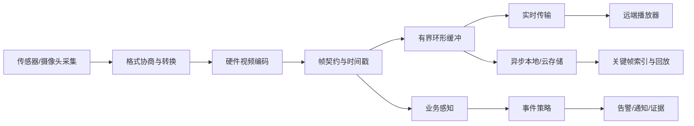
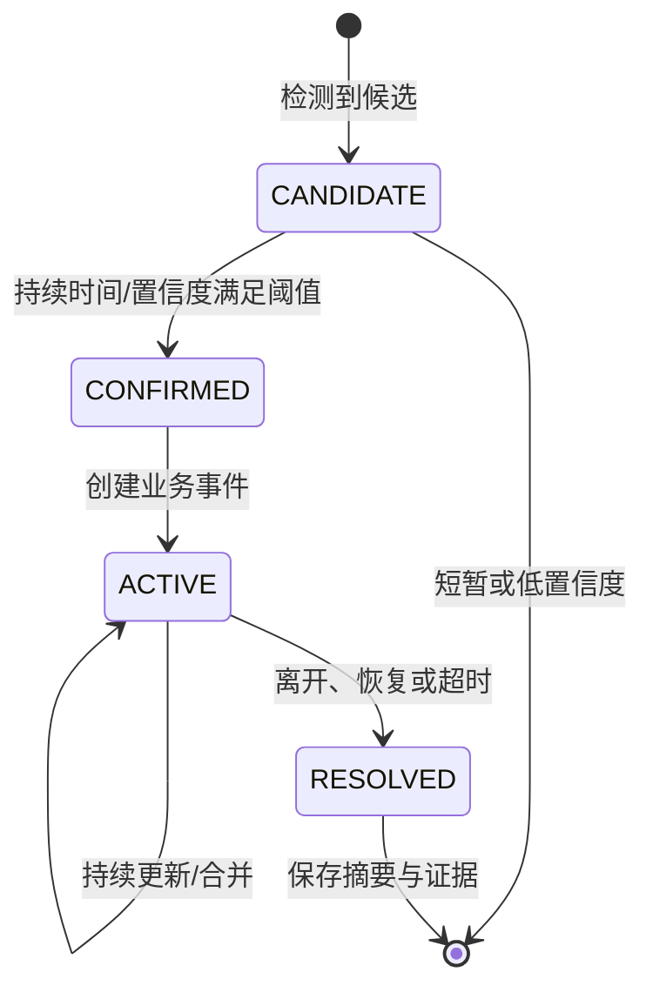

# 专业 IPC 的业务感知工程实践

> 学习路径：本文把媒体链路、存储可靠性和业务事件串成闭环。建议先阅读[超低功耗设备工程实践](./超低功耗设备工程实践.md)，升级场景见[低功耗设备 OTA 工程实践](./低功耗设备%20OTA%20工程实践.md)。

## 1. 专业 IPC 的判断标准

专业 IPC（Internet Protocol Camera）不是“摄像头能出一张图”，也不是“把编码数据发到远端”。它要在长时间运行、网络波动、存储抖动和业务事件同时发生时，仍然提供可观看、可检索、可解释、可恢复的结果。

一条合格的 IPC 链路至少要保证：

- 视频帧有稳定的时间戳和关键帧边界。
- 音频与视频在播放端不会持续漂移。
- 硬件编码器的输出可以被实时传输和存储消费。
- 网络抖动或存储写入变慢时，直播不会被同步文件写入拖死。
- 丢帧后能在下一个关键帧重新建立可解码画面。
- 录像能够按时间查询、快速定位和连续回放。
- 业务事件能够说明“发生了什么、何时发生、依据是什么、采取了什么策略”。

## 2. 端到端架构

推荐把媒体链路拆成清晰的生产者、缓冲层、消费者和业务层：



每个箭头都应有明确的所有权和背压规则。采集线程不应该等待网络发送，编码线程不应该同步等待文件系统分配簇，业务检测也不应该阻塞实时帧生产。

## 3. 采集与格式转换

### 3.1 先确认能力，再打开设备

打开摄像头前先查询设备能力：分辨率、帧率、输入像素格式、输出格式、缓冲方式和最大帧大小。配置请求与实际能力不匹配时，应在打开阶段明确失败，而不是等到第一帧才静默丢弃。

常见输入包括 YUV、NV12、MJPEG 等。硬件编码器往往要求特定的内存布局、stride、对齐方式和色彩格式。格式转换必须显式记录：

- 原始格式与目标格式。
- 宽高、stride 和裁剪区域。
- 缓冲区是否连续、是否可被编码器直接访问。
- 转换是否由专用硬件完成。
- 转换失败时的丢帧和告警策略。

### 3.2 视频编码只走硬件加速

实时 IPC 视频应使用目标芯片提供的硬件编码器。软件编码会争用主核、内存带宽和缓存，难以稳定满足高分辨率、低延迟和长时间运行要求，也会放大功耗和温升问题。

编码器配置至少包括：

- 编码格式和 profile。
- 分辨率、stride 和帧率。
- 目标码率和码率控制模式。
- GOP 长度和关键帧策略。
- 输入帧时间戳与输出帧时间戳的映射。
- 编码缓冲区的申请、归还和异常释放。

不要只把“支持 H.264”写在能力位图里。能力声明必须与运行时真正能输出的格式一致；否则上层会成功打开设备，却在第一帧时遇到不可恢复的格式错误。

## 4. 帧契约：数据、时间和生命周期

媒体帧不只是 `data + size`。推荐建立统一帧契约：

```text
frame = {
    stream_id,
    codec,
    frame_type,       // key / inter / audio
    data,
    size,
    pts_us,           // 播放时间戳
    capture_ts_ms,    // 采集或墙上时间
    is_complete,
    sequence,
    owner,
    release()
}
```

### 4.1 关键帧是恢复边界

直播队列丢帧时，应丢到下一个关键帧，而不是继续发送无法独立解码的 P 帧。消费者重连、队列溢出、编码器重置和网络恢复都应触发或请求一次关键帧。

推荐的有界队列行为：

1. 队列满时丢弃最旧的非关键帧。
2. 记录进入“等待关键帧”状态。
3. 在下一个关键帧到达前，不向远端发送残缺 GOP。
4. 关键帧到达后清除等待状态。
5. 记录丢帧数量、等待时长和恢复次数。

### 4.2 时间戳必须有单一来源

`PTS` 用于播放节奏，采集时间用于录像检索和业务事件对齐。两者可以来自不同的时钟，但必须记录转换关系。不要用固定 FPS 重新推算所有时间戳，实际采集可能因传感器、调度或网络而抖动。

音视频同步应以时间戳为准，不要默认“每帧固定间隔”。发生时钟跳变时，应记录校时事件，并由回放端或同步层做有限速率的修正，避免突然跳跃。

### 4.3 所有权必须明确

常见的帧生命周期错误包括：编码器已经复用缓冲区，传输线程还在读取；本地存储线程仍在写，生产者却提前释放；回调返回后，上层继续持有临时指针。

可选的安全策略有两种：

- 回调内复制到有界队列，队列拥有独立内存。
- 使用引用计数缓冲区，所有消费者完成后统一释放。

无论采用哪种方式，都应在接口上明确“指针有效到什么时候”和“谁负责释放”。

## 5. 实时传输与本地存储必须解耦

### 5.1 直播链路

直播消费者需要低延迟和连续关键帧。它可以接受有限丢帧，但不能接受长时间阻塞。传输队列应有上限，满载时采取“丢旧帧、等关键帧、恢复发送”的策略。

### 5.2 存储链路

文件系统写入可能因为擦除、目录更新、FAT 分配或介质抖动出现几十到几百毫秒级阻塞。不能在编码回调里同步写文件。推荐：

```text
编码回调 → 拷贝入内存环 → 写线程批量落盘 → 周期性同步 → 更新索引
```

环形缓冲满时要有确定策略：记录溢出、丢弃到下一个关键帧，并确保文件不会从关键帧中间开始，避免生成不可解码片段。

### 5.3 录像格式与索引

文件格式应把每帧作为带头部的记录，头部至少包含帧类型、负载长度、墙上时间和播放时间戳。录像旁边维护关键帧索引，索引记录相对时间和文件偏移。

查询某个时间点时，先通过索引定位到不晚于目标时间的关键帧，再顺序读取后续帧。不要每次回放都从文件开头扫描 Annex-B 起始码，也不要依赖固定 FPS 猜时间；这两种方式在长录像和帧率抖动时都会造成定位漂移。

文件提交建议使用临时文件、同步和原子重命名。开机时扫描未登记或未完整关闭的片段，利用最后一个有效关键帧修复索引或将损坏尾部隔离。

## 6. 音频与双向通话

音频链路要单独建立采样率、位宽、声道和编码契约。若设备端采集采样率与传输格式不同，应在音频端口层完成重采样，再将固定时长的音频帧送入编码器或传输队列。

双向通话至少需要：

- 上行麦克风队列和下行播放队列分别有界。
- 播放期间对近端麦克风做明确的抑制、衰减或回声处理策略。
- 队列溢出、下行断流和播放欠载可观测。
- 音频时间戳与视频时间轴使用可关联的时钟。
- 停止通话时先停止采集和播放，再释放音频设备。

“有声音”不等于“可用通话”。需要关注延迟、丢帧、欠载、回声、噪声门限和恢复时间。

## 7. 业务感知：从检测结果到可执行事件

业务感知不是简单地在视频上叠加一个分类标签。一个可交付的事件应同时表达四件事：

1. **事件**：发生了什么，例如进入、离开、停留、遮挡、异常声音或设备被移动。
2. **置信度**：模型或规则有多确定，以及采用了什么阈值。
3. **策略**：事件持续多久、是否去重、何时升级、是否需要录像或通知。
4. **可观测性**：能否找到触发事件的时间窗、证据帧、模型版本和设备状态。

### 7.1 事件生命周期

事件不应只是一条瞬时消息。推荐使用 `candidate → confirmed → active → resolved` 生命周期：



这样可以避免一帧中的误检直接触发告警，也能把连续数分钟的同一行为合并成一个事件，而不是发送数百条重复通知。

### 7.2 事件契约示例

下面是通用结构，字段名可以按产品规范调整：

```json
{
  "event_id": "设备内唯一标识",
  "event_type": "person_stay",
  "state": "confirmed",
  "start_time": 1710000000000,
  "end_time": null,
  "confidence": 0.91,
  "region": {"x": 0.12, "y": 0.18, "w": 0.34, "h": 0.62},
  "policy": {
    "min_duration_ms": 5000,
    "dedup_window_ms": 60000,
    "evidence": "keyframe_before_after"
  },
  "evidence": {
    "stream_id": "main",
    "keyframe_time": 1710000001200,
    "record_ref": "按时间可检索的录像引用"
  },
  "model": {
    "name": "detector_name",
    "version": "detector_version"
  }
}
```

事件里的 `record_ref` 必须能在录像索引中定位到可解码画面；只发送一条告警文字而无法提供证据，会让运营和用户无法判断事件是否可信。

### 7.3 置信度不能脱离时间窗

单帧置信度适合做候选，业务确认应结合时间窗、连续帧数量、区域稳定性和上下文状态。可以使用滞回阈值：进入事件使用较高阈值，维持事件使用较低阈值，结束事件需要连续一段时间不满足条件。

策略层应独立于检测模型。模型只提供候选事实，策略决定是否通知、录像多久、是否升级到更高优先级，以及用户是否需要确认。

## 8. 事件、录像和通知的闭环

一个业务事件的完整闭环应是：

```text
候选检测
  → 事件确认
  → 反向定位事件前缓冲
  → 继续采集事件后窗口
  → 关键帧边界切片
  → 保存/上传证据
  → 发送通知
  → 用户查看
  → 事件结束与结果归档
```

因此，业务感知会反向影响媒体管线：

- 需要事件前证据，就要保留短时环形视频缓存。
- 需要精确回放，就要保证关键帧索引和时间戳可靠。
- 需要通知去重，就要有稳定的事件 ID 和生命周期。
- 需要解释误报，就要保存置信度、模型版本、区域和触发帧。
- 需要省电，就要让检测频率、摄像头唤醒和上传策略可动态调整。

## 9. 可观测性指标

| 层级 | 指标 | 能发现的问题 |
| --- | --- | --- |
| 采集 | 实际 FPS、采集丢帧、格式协商结果 | 传感器、驱动或带宽不匹配 |
| 编码 | 编码耗时、队列深度、关键帧间隔、输出大小 | 编码器过载、码率失控 |
| 传输 | 发送延迟、重传、丢帧到关键帧恢复时间 | 网络抖动、背压和断流 |
| 存储 | 环使用率、写入最大耗时、落盘丢帧、索引修复次数 | 介质抖动、空间不足、文件损坏 |
| 回放 | 首帧时间、定位误差、音视频漂移 | 时间戳或索引错误 |
| 音频 | 采样率、欠载、溢出、端到端延迟 | 音频设备和队列问题 |
| 业务 | 候选数、确认率、去重率、误报反馈 | 阈值和策略问题 |
| 设备 | 温度、电流、内存、重启原因 | 长时间稳定性和功耗问题 |

日志应以采样方式记录高频数据，以计数器记录累计数据，以事件 ID 串起媒体、存储和通知链路。不要在每一帧打印完整日志，避免日志本身改变实时性和功耗。

## 10. 故障排查顺序

遇到“没有画面”时，按链路顺序排查：

1. 采集设备是否打开，实际格式和分辨率是什么。
2. 是否真的产生原始帧，时间戳是否递增。
3. 格式转换输出是否满足硬件编码器要求。
4. 编码器是否产生完整访问单元，是否包含关键帧。
5. 帧是否在队列中被丢弃，是否进入等待关键帧状态。
6. 传输回调是否读取正确的长度和所有权。
7. 接收端媒体描述是否与实际编码格式一致。

遇到“直播正常但录像卡顿”时，优先检查存储写入是否在编码回调中同步执行、环是否溢出、写线程最大耗时和关键帧恢复策略。遇到“录像能看但时间轴不准”时，检查时间戳来源、时钟跳变、索引偏移和是否使用固定 FPS 推算。

遇到“告警很多但用户不信任”时，检查事件去重、确认时间窗、置信度阈值、证据帧是否与事件时间一致，以及模型版本是否能追溯。

## 11. 验收清单

### 媒体链路

- [ ] 采集能力、格式转换和编码器能力在打开阶段完成协商。
- [ ] 视频编码使用硬件加速，输入布局、stride 和缓冲所有权明确。
- [ ] 关键帧、普通帧、音频帧和时间戳契约统一。
- [ ] 队列有界，满载时丢帧行为和关键帧恢复行为明确。
- [ ] 直播、存储和业务检测互不在关键线程上同步阻塞。

### 存储与回放

- [ ] 异步写线程批量落盘，编码回调不直接等待文件系统。
- [ ] 每帧记录包含类型、长度、时间戳和播放时间信息。
- [ ] 关键帧索引支持按时间快速定位。
- [ ] 掉电或写入中断后能修复索引或隔离损坏尾部。
- [ ] 存储空间不足、介质变慢和环溢出都有可观察指标。

### 业务感知

- [ ] 事件包含类型、状态、时间窗、置信度、策略和证据引用。
- [ ] 候选、确认、持续和结束状态有清晰转移条件。
- [ ] 相同事件支持去重、合并和升级，不重复轰炸用户。
- [ ] 证据帧能通过录像索引定位，且与事件时间一致。
- [ ] 模型版本、阈值和设备状态可追溯。

### 长时间运行

- [ ] 覆盖网络断开、重连、传输阻塞和关键帧恢复。
- [ ] 覆盖存储写入抖动、空间不足和重启恢复。
- [ ] 覆盖音频欠载、溢出和双向通话切换。
- [ ] 覆盖摄像头重启、编码器异常和设备复位。
- [ ] 记录 24 小时以上运行的内存、温度、功耗和事件统计。

## 12. 小结

专业 IPC 的核心是把媒体质量和业务可信度同时做出来：采集、格式转换、硬件编码、传输、存储和回放必须共享可靠的帧契约；业务感知必须把事件、置信度、策略和证据串起来；所有链路都要能解释丢了什么、为什么丢、何时恢复。做到这一点，IPC 才不是一条“能出流”的演示链路，而是可以长期运行、可运营、可追责的产品系统。
