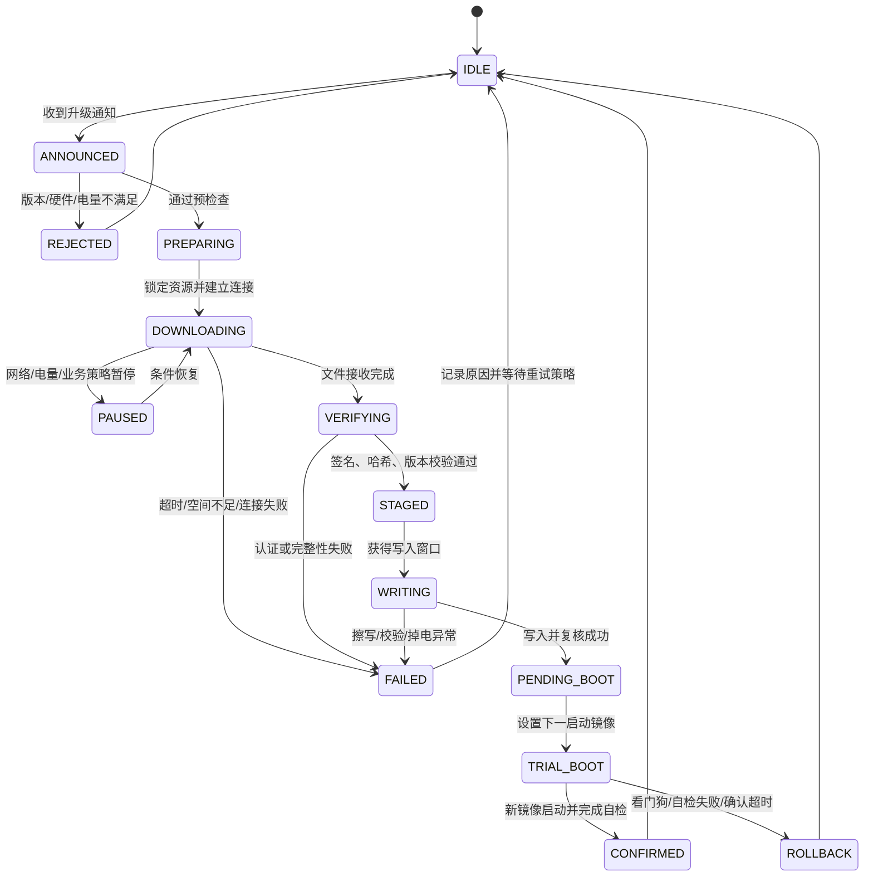

# 低功耗设备 OTA 工程实践

> 学习路径：本文讨论升级事务如何与睡眠、网络和掉电恢复协同；前置阅读[超低功耗设备工程实践](./超低功耗设备工程实践.md)，后续可阅读[专业 IPC 的业务感知工程实践](./专业%20IPC%20的业务感知工程实践.md)。

## 1. OTA 是一次受保护的系统事务

OTA（Over-the-Air）不是“下载一个文件然后重启”。它同时改变设备的软件版本、启动选择、持久化状态和故障恢复路径。对低功耗设备而言，OTA 还要临时改变睡眠策略：下载可以允许网络省电，但校验、擦写和启动切换不能被睡眠打断。

一次可交付的 OTA 至少要回答：

- 设备为什么接受这次升级，升级包是否确实发给了这类硬件。
- 下载中断后从哪里恢复，已经写入的内容是否可继续使用。
- 文件完整性和来源如何验证，传输加密是否被误当成签名认证。
- 什么时候允许写入，掉电后启动器如何选择可启动镜像。
- 新镜像首次启动失败时，如何自动回到旧镜像。
- 低电量、网络抖动、存储空间不足和业务正在运行时如何处理。

## 2. 推荐的 OTA 状态机

状态机要有明确的持久化边界。内存中的状态只能用于当前运行；凡是掉电后仍需判断的内容，都要写入可靠的状态记录，并采用校验和、版本号或双副本防止记录损坏。



推荐将以下字段持久化：当前运行版本、目标版本、升级事务 ID、镜像槽位、已下载偏移、镜像总长度、校验进度、写入状态、试运行次数、确认期限和最后失败原因。

## 3. 控制面与数据面分离

### 3.1 控制面

控制面负责接收升级通知、检查设备条件、上报状态和决定是否开始。通知中至少应包含目标版本、镜像大小、下载地址或对象标识、硬件兼容条件、版本约束和签名材料的引用。

设备收到通知后不要立即创建下载线程。先完成预检查：

- 目标版本是否高于当前版本，是否满足防回滚规则。
- 硬件型号、闪存容量、内存容量和功能集合是否兼容。
- 电池是否高于升级阈值，或设备是否接入稳定外部电源。
- 临时分区、缓存或目标镜像槽位是否有足够空间。
- 当前是否正在录音、录像、通话、报警或执行不可中断动作。
- 当前网络是否满足下载超时和重试预算。

预检查失败要返回可分类的原因，而不是统一返回“升级失败”。

### 3.2 数据面

数据面负责分段下载、断点续传、流式校验、写入临时区域和最终提交。下载块不应直接写入正在运行的镜像。常见安全结构是：

```text
下载临时区 → 分片校验 → 全量认证 → 目标镜像槽位 → 写后复核 → 启动器切换
```

临时区可以是文件、独立分区或专用缓存，具体选择由存储布局决定，但必须保证“未完成镜像不会被当成可启动镜像”。

## 4. 完整性、真实性和传输安全

这三个概念必须分开：

- **传输安全**：保护网络链路，减少窃听和中间人篡改风险。
- **完整性校验**：判断下载内容是否在传输或存储中损坏。哈希适合发现损坏，但本身不能证明来源。
- **真实性认证**：证明镜像来自可信发布者。应使用签名或等价的密钥认证机制，并在设备端验证签名。

不能因为下载使用加密连接，就省略镜像签名。设备端的认证流程至少应验证：

1. 签名覆盖的内容边界明确，不能只签元数据而漏掉镜像主体。
2. 版本、硬件兼容字段和镜像长度都在认证范围内。
3. 公钥或信任锚的更新有独立的安全策略。
4. 旧版本不能利用升级入口替换成不受支持的版本。
5. 哈希、签名和长度校验失败时，不进入写入和启动切换。

日志可以记录认证结果、算法、版本和错误分类，但不能打印密钥、完整令牌或下载地址中的敏感参数。

## 5. 断点续传与低功耗网络

低功耗设备的下载应以“可暂停、可恢复”为默认设计，而不是假设一次连接能完成整个镜像。

### 5.1 分片设计

每个分片建议具有：序号或偏移、有效长度、分片校验、事务 ID 和可选的重试计数。设备要持久化已确认的连续偏移，而不是只保存“最后收到的偏移”。这样可以避免乱序或重复数据导致恢复点错误。

使用 HTTP Range 或等价的分段协议时，客户端必须同时校验请求偏移、响应状态、响应长度和 `Content-Range`。服务端返回的起始偏移、结束偏移和总长度必须与本地事务记录一致；遇到短包、越界、总长度变化或服务器忽略 Range 时，应丢弃当前响应并重新协商，不能把响应直接追加到镜像。

断点记录应放在掉电后仍可读的非易失存储中，至少包含事务 ID、目标版本、镜像总长度、已确认连续偏移和校验上下文版本。推荐使用双副本、序列号和校验和：先写新副本并校验，再标记为最新；启动恢复时选择序列号最高且校验有效的记录。若哈希上下文无法安全恢复，应从最近一个可验证边界重新计算，而不是假设 RAM 中的哈希状态仍然存在。

分片大小在网络效率、RAM 占用、写入粒度和失败重试成本之间取平衡。具体数值必须由目标网络和存储实测决定，不要把某个产品的块大小当作通用标准。

### 5.2 与无线睡眠协同

下载阶段可以在分片之间进入较浅的网络省电，但必须满足：

- 当前分片请求、响应和重试计时器仍然有效。
- 睡眠窗口小于服务端和客户端的超时预算。
- 设备知道下一次唤醒时间，不会让连接层误判超时。
- 断点状态在释放网络资源前已经安全提交。

一旦进入校验、擦除、写入或启动切换，必须持有禁止深睡的锁。不要只在“开始 OTA”时加锁、在创建下载线程后立即释放；异步下载线程和写入线程的完整生命周期都必须受到约束。校验失败、写入失败或事务取消时，要在释放锁之前完成临时文件/事务标记的清理或置为可恢复状态，并发送一次明确的失败结果；不能依赖正常完成路径释放资源。

### 5.3 低电量策略

升级前应检查电量和供电状态。升级中电量下降到危险阈值时，优先暂停在可恢复边界，而不是为了省电强行进入深睡。擦写操作开始后，必须确保电源稳定到足以完成当前最小不可分割步骤。

## 6. 写入、启动切换与回滚

### 6.1 可恢复写入

推荐采用双镜像、临时镜像加启动标志，或其他等价的可恢复布局。核心原则不是“必须双分区”，而是任何时刻都要有一个确定可启动的旧镜像或恢复路径。

写入流程应包含：

1. 确认目标区域不是当前运行镜像。
2. 擦除前记录升级事务和目标槽位。
3. 分块写入并在每个安全边界复核。
4. 写入完成后重新读取关键区域，验证长度、哈希和签名关联。
5. 只在全部验证成功后，原子地更新下一启动标志。
6. 保留旧镜像的可启动状态，直到新镜像完成首次启动确认。

### 6.2 试运行与确认

新镜像第一次启动应处于 trial 状态。启动器或系统服务要等待应用完成最小自检，例如：内存初始化、关键外设初始化、网络栈启动、持久化数据读取和看门狗喂养。应用在确认窗口内显式写入“启动成功”，否则下次启动自动回滚。

确认窗口不能过短，否则网络尚未恢复就被误判失败；也不能无限等待，否则损坏镜像会长期占用启动槽位。窗口大小和自检项目应通过故障注入确定。

## 7. OTA 与业务并发

升级前应建立业务排空策略，而不是简单杀掉所有线程：

- 停止新的录像或上传任务。
- 对正在编码的帧完成当前访问，释放编码器和 DMA。
- 对正在写入的媒体片段执行提交或标记为可恢复。
- 停止音频播放和录音，保存必要的业务状态。
- 取消非关键定时器，保留升级超时和看门狗。
- 对用户提示“正在升级”，避免业务层继续触发高功耗操作。

若产品要求升级期间仍能维持远程控制，应把控制通道与下载通道分离，并给控制通道保留最小网络能力。若不能保证，就应明确升级期间的可达性边界，不能让云端继续发送会被设备丢失的业务命令。

## 8. 故障注入矩阵

| 故障点 | 预期设备行为 | 必须保留的证据 |
| --- | --- | --- |
| 通知字段缺失 | 拒绝开始，不创建写入事务 | 字段校验结果 |
| 硬件不兼容 | 拒绝安装 | 当前硬件、目标兼容条件 |
| 空间不足 | 拒绝或清理临时区后重试 | 可用空间、所需空间 |
| 下载中断 | 保存连续偏移，稍后续传 | 事务 ID、偏移、重试次数 |
| 分片损坏 | 丢弃该分片并重试 | 分片序号、校验结果 |
| 全量认证失败 | 删除或隔离临时镜像 | 认证错误分类 |
| 擦除中掉电 | 下次启动旧镜像仍可用 | 启动槽位和事务状态 |
| 写入中掉电 | 不启动未完成镜像 | 写入边界、复核结果 |
| 首次启动自检失败 | 自动回滚 | 失败阶段、复位原因 |
| 升级后网络不可用 | 保留本地回滚能力，不循环擦写 | 网络恢复计时和启动次数 |
| 低电量进入升级 | 不开始或暂停在安全边界 | 电压、电源状态 |

每类故障至少在实验室执行一次。对掉电测试，应覆盖擦除、写入、更新启动标志和首次启动确认四个窗口。

## 9. 可观测性与状态上报

状态上报要能让云端和现场测试区分“正在下载”“下载暂停”“认证失败”“写入失败”和“新镜像未确认”。建议统一记录以下字段：

| 字段 | 含义 |
| --- | --- |
| transaction_id | 一次升级事务的唯一标识 |
| current_version | 当前运行版本 |
| target_version | 目标版本 |
| state | 当前状态机状态 |
| confirmed_offset | 已确认的连续下载偏移 |
| retry_count | 当前阶段重试次数 |
| power_guard | 是否持有禁止深睡约束 |
| storage_free | 当前可用空间 |
| boot_attempt | 新镜像试启动次数 |
| last_error | 最后一次分类错误 |
| reset_reason | 最近一次启动/复位原因 |

日志要带时间戳和事务 ID。升级完成后不要立刻清掉全部记录，至少保留最近一次成功或失败摘要，方便区分“升级没有开始”“升级完成但未启动”“启动后回滚”。

## 10. 验收指标

指标必须写成带条件的句子，例如“在指定电量、网络和供电条件下，镜像大小为 X 时，完成率达到 Y%”。建议覆盖：

- 通知到开始下载的决策时延。
- 下载吞吐、分片重试率和断点恢复成功率。
- 认证失败拦截率，以及认证失败后是否绝不进入写入。
- 升级期间的最大电流、平均能量和低功耗锁持有时间。
- 掉电恢复成功率。
- 新镜像首次启动确认时间。
- 自动回滚成功率和回滚耗时。
- 升级后业务恢复时间，包括网络、摄像头、音频和存储。
- 连续多次升级是否存在临时文件、启动标志或版本状态泄漏。

## 11. 上线前检查清单

### 升级包与安全

- [ ] 版本、硬件兼容条件、长度和签名覆盖范围明确。
- [ ] 设备验证真实性，不只验证传输通道加密。
- [ ] 版本防回滚策略已定义并经过异常输入测试。
- [ ] 认证失败不会擦除当前可启动镜像。
- [ ] 日志和状态上报不会泄露密钥或敏感 URL 参数。

### 下载与存储

- [ ] 下载支持断点续传，并持久化连续确认偏移。
- [ ] 临时镜像不会被启动器误识别为可启动镜像。
- [ ] 空间不足、重复分片、乱序分片和下载超时都有明确行为。
- [ ] 写入完成后有读回或等价的复核机制。
- [ ] 掉电测试覆盖擦除、写入和启动标志更新窗口。

### 低功耗与业务

- [ ] 下载、校验、擦写和启动切换分别定义睡眠约束。
- [ ] 异步线程生命周期内始终保持正确的功耗锁。
- [ ] 低电量不会把设备带入不可恢复的写入窗口。
- [ ] 录像、音频、编码和文件系统任务在升级前有排空流程。
- [ ] 升级期间的远程可达性边界已向业务明确。

### 启动与恢复

- [ ] 新镜像采用试运行和显式确认机制。
- [ ] 启动失败、看门狗复位和自检超时会触发回滚。
- [ ] 能区分冷启动、升级启动、回滚启动和正常唤醒。
- [ ] 回滚后不会无限重复升级或反复擦写。
- [ ] 升级后关键业务在目标时间内恢复。

## 12. 小结

可靠 OTA 的关键不是下载速度，而是把“接受、下载、认证、写入、启动、确认、回滚”做成一条可恢复事务。低功耗设备还必须把每个不可中断窗口显式接入功耗仲裁：可暂停的下载可以与睡眠协同，不可打断的校验和写入必须优先保证电源与执行上下文。最终验收要同时看安全性、可恢复性、能量成本和业务恢复时间。
