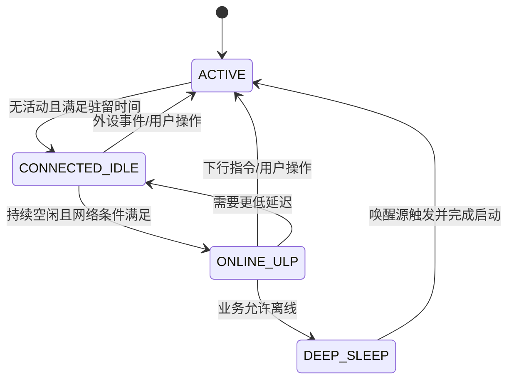

# 超低功耗设备工程实践

> 学习路径：本文建立功耗状态、网络保活、睡眠唤醒和测量方法；完成后可继续阅读[低功耗设备 OTA 工程实践](./低功耗设备%20OTA%20工程实践.md)与[专业 IPC 的业务感知工程实践](./专业%20IPC%20的业务感知工程实践.md)。

## 1. 先定义“低功耗”要解决什么问题

低功耗不是把某个瞬时电流压到最低，而是在明确的业务约束下，减少单位时间消耗的能量，同时保留设备必须具备的响应能力、在线能力和可恢复能力。

同一台设备通常同时存在三种需求：

- **即时交互**：用户正在操作，设备需要低延迟响应，摄像头、音频、显示和网络都可能处于活跃状态。
- **在线待机**：设备保持与网络的关联，能够接收云端或局域网指令，但允许响应延迟增加。
- **离线深睡**：设备不维持连接，只有按键、定时器或外部信号唤醒；唤醒后通常要重新初始化系统。

这三种需求不是一个“省电开关”能够覆盖的。工程上应先定义状态，再定义状态之间的切换条件，最后把每个状态映射到目标芯片和外设能够真正执行的动作。

### 1.1 两个容易混淆的判断

**在线待机不等于离线深睡。** 在线待机保留网络可达性和部分内存上下文，功耗通常高于离线深睡，但它能承接下行命令。离线深睡可能更省电，却要接受连接丢失、上下文丢失和重新启动时间。

**数据手册数字不等于整机数字。** 芯片核心、无线协处理器、外部内存、稳压器、传感器、指示灯和调试接口都会进入最终功耗。只有在目标板、目标固件、目标供电路径上测得的数据，才能作为产品指标依据。

## 2. 建立功耗状态模型

推荐用“从浅到深”的离散状态描述设备。每个状态至少记录五类元数据：允许的网络行为、保留的内存、唤醒延迟、允许进入的最短驻留时间，以及进入和退出时需要执行的动作。

一个通用的四档模型如下：

| 状态 | 网络 | 内存与外设 | 典型用途 | 主要代价 |
| --- | --- | --- | --- | --- |
| ACTIVE | 全速收发 | 关键外设保持工作 | 交互、采集、播放、升级 | 功耗最高 |
| CONNECTED_IDLE | 保持关联，按周期收包 | 主核可睡，必要上下文保留 | 在线待机、远程控制 | 下行延迟增加 |
| ONLINE_ULP | 保持关联，低频轮询或协商唤醒 | 只保留联网必需资源 | 长时间在线保活 | 响应窗口变长，受网络环境影响 |
| DEEP_SLEEP | 断开网络 | 大量上下文丢失或仅保留少量 RAM | 电池长期存放、定时采样 | 唤醒后接近一次重新启动 |

状态的深浅不要直接用枚举数值比较。更稳妥的做法是建立一条明确的降级链，状态在链中的位置同时表示深浅关系和自动降级顺序。这样加入自定义状态时，不会因为枚举值恰好较大而误判功耗深度。



### 2.1 用“最严格约束”仲裁，而不是互相覆盖

多个子系统可能同时提出功耗要求：音频播放要求保持时钟，显示刷新要求保持 SPI，网络关联要求保持无线，升级任务要求禁止深睡。最终状态应由所有约束共同决定。

建议同时提供两种机制：

- **持档锁**：某项任务在一段时间内声明“不要低于某个状态”。下载、录音、播放、关键传输都应成对获取和释放。
- **外设 consumer**：外设登记自己的最浅供电状态，并提供 suspend/resume。系统进入更深状态前先按依赖顺序挂起外设，恢复时反向执行。

可以把仲裁抽象成：

```text
目标状态 = 空闲策略给出的最深状态
           与所有持档锁、产品功耗上限、临时任务约束共同取最浅者
```

锁必须具备引用计数或句柄生命周期，避免一个子系统释放锁时误伤另一个子系统。调试接口至少要能打印当前状态、降级链、每把锁的持有者和每个 consumer 的挂起状态。

### 2.2 空闲防抖与最小驻留时间

睡眠切换存在成本：停外设、切时钟、配置唤醒源和恢复上下文都需要时间和能量。如果刚进入深睡就被唤醒，节省的能量可能抵不过切换成本。

每个状态应设置：

- **最小驻留时间**：预计至少能睡多久，才值得进入该状态。
- **退出延迟**：从该状态恢复到可服务状态需要多久。
- **降级防抖时间**：活动暂时停止后，等待多长时间再真正降档。

基本判断可以写成：

```text
预计空闲时间 >= 最小驻留时间 + 进入/退出开销
```

不要在每个业务模块里各自实现 timeout。空闲判定应尽量复用 RTOS 调度器的 idle/tickless 结果，再由功耗策略决定允许的最深状态。

## 3. 网络低功耗：延迟、功耗和可达性的三方约束

联网设备的低功耗通常不是“关闭无线”，而是让无线在更长的睡眠窗口中工作。接入点会在缓存下行数据后，于约定的信标或唤醒窗口发送；设备醒来后批量接收。

### 3.1 轮询间隔的真实含义

DTIM、listen interval、TWT 或类似机制，本质上都是“多久醒来一次”的协商方式。间隔越长，接收监听次数越少，平均功耗越低，但下行延迟、缓存压力和丢失窗口的风险越高。

设计时应同时记录三项：

1. 设备承诺的最大下行延迟。
2. 网络侧能够稳定缓存和转发的最长睡眠窗口。
3. 实际家庭网络中广播、组播、ARP 和重传造成的额外唤醒次数。

不能只在干净的测试接入点下测一次平均电流。真实网络中的广播噪声经常比理论心跳更频繁，尤其是当 TCP/IP 协议栈运行在主核、无线协处理器只负责射频和链路控制时，每个到达主核的帧都可能把主核唤醒。

### 3.2 心跳、轮询和连接状态要协同

应用层心跳周期不能独立于无线睡眠窗口。若心跳在设备睡眠期间到期，协议栈可能误判超时，出现“省电后经常掉线”。应让连接保活策略知道设备的在线低功耗档位：

- 在线待机：保留较短的心跳和较快的接收窗口。
- 超低功耗在线：延长心跳，或改为由云端已知的 check-in 窗口唤醒。
- 离线深睡：停止在线心跳，记录唤醒后的重新连接策略。

进入在线低功耗前必须确认设备已成功关联网络。未关联时强行设置省电参数，可能让连接流程本身卡住。可用一把“网络关联门控锁”：关联完成后释放，掉线后重新持有。

### 3.3 过滤广播不能代替协议设计

过滤无关广播能显著减少主核唤醒，但不能无条件丢弃 ARP、地址解析、网络发现或业务真正依赖的组播。每次过滤策略调整都要在真实网络中验证：

- DHCP 续租是否正常。
- 地址解析是否正常。
- 云端长连接是否持续。
- 局域网发现是否仍符合产品要求。
- 设备从睡眠醒来后是否能及时处理积压数据。

## 4. 内存保持决定深睡下限

很多系统在浅睡时只关闭 CPU 时钟，在深睡时还会关闭片上 RAM、Flash 或外部 RAM。若代码、堆、网络缓冲区和业务上下文大量位于外部 RAM，那么外部 RAM 的供电方式会直接决定整机下限。

### 4.1 三种常见情况

- **常供电保持**：上下文完整，唤醒快，但外部 RAM 的静态电流可能成为整机底线。
- **半睡眠或低功耗保持**：在数据保持和电流之间折中，需要验证唤醒时序、时钟和数据完整性。
- **断电**：功耗最低，但唤醒后必须重新启动，不能依赖易失上下文。

不要为了追求一个漂亮的深睡数字，忽略恢复路径。至少要验证：

1. 睡前后堆管理器仍然一致。
2. 网络凭据、业务状态和计时器是否需要持久化。
3. 外部 RAM 的唤醒代码是否位于不会被关闭的片上 RAM。
4. 睡眠过程中是否有 DMA、缓存写回或 Flash 命令尚未完成。
5. 唤醒后时间基准是否连续，或者应用能否正确处理时间跳变。

### 4.2 睡眠态与唤醒源必须配套

不是所有 GPIO、串口或无线中断都能唤醒最深睡眠。板级设计应维护一张“睡眠态—唤醒源矩阵”，明确每个引脚的电平极性、去抖方式和可唤醒的最低状态。

| 唤醒源 | 浅睡 | 保持型深睡 | 断电深睡 | 产品注意事项 |
| --- | --- | --- | --- | --- |
| 外部按键 | 通常支持 | 取决于引脚域 | 仅特定低功耗域支持 | 复核引脚归属和极性 |
| RTC/定时器 | 支持 | 支持 | 通常支持 | 校验时钟误差和唤醒后校时 |
| 无线下行 | 支持 | 常见支持 | 通常不支持 | 在线档与离线档语义不同 |
| 普通串口 | 常见支持 | 取决于外设域 | 通常不支持 | 日志本身可能阻止深睡 |
| 看门狗 | 支持 | 支持 | 视芯片而定 | 区分复位与正常唤醒 |

## 5. 低功耗与外设生命周期

系统级降档前，必须先让外设完成“收尾”：停止采集、排空 DMA、静音音频、提交最后一帧、关闭片选或切断电源域。系统恢复后再按依赖顺序重新初始化。

推荐给每个外设定义以下契约：

```text
consumer = {
    name,
    min_powered_state,
    suspend(),
    resume(),
    dependency_priority
}
```

`suspend()` 可以执行阻塞操作，但必须运行在线程上下文，不能在中断中等待总线。依赖优先级要表达真实关系：依赖电源域的传感器应晚于电源域挂起，恢复时早于电源域可用之后的业务线程。

以下活动通常要持有更浅状态的锁：

- Flash 擦写、文件系统提交和日志刷盘。
- 音频播放、录音、回声处理和持续 DMA。
- 摄像头采集、硬件编码和网络发送。
- 显示刷新、触摸扫描和背光渐变。
- 配网、扫描、关联和密钥交换。
- OTA 下载、校验、镜像写入和启动切换。

锁的获取和释放必须覆盖完整的异步生命周期，而不是只包住“发起操作”的函数。异步任务启动后立即释放锁，是最常见的低功耗竞态之一。

## 6. 测量方法：先固定条件，再谈数字

### 6.1 测量设备和接线

测量点应覆盖产品真实供电入口，而不只是某一颗芯片的电源脚。使用电流分析仪或功耗仪时，记录量程、采样率、供电电压、线缆和外接设备。若调试串口、屏幕背光或 USB 转换器仍然供电，应在报告中单独列出。

### 6.2 最小场景矩阵

| 场景 | 网络 | 主核 | 主要外设 | 记录指标 |
| --- | --- | --- | --- | --- |
| 冷启动 | 未关联 | 全速 | 全部初始化 | 启动峰值、启动时长 |
| 已关联空闲 | 在线 | 活跃 | 外设关闭 | 平均电流、唤醒次数 |
| 在线待机 | 在线 | 睡眠 | 保留网络 | 平均电流、下行延迟 |
| 超低功耗在线 | 在线 | 间歇唤醒 | 最小资源集 | 平均电流、丢包率 |
| 离线深睡 | 断网 | 断电或保持 | 仅唤醒源 | 底电流、唤醒时长 |
| 真实网络 | 家庭网络 | 按策略 | 目标外设 | 广播唤醒占比、24 小时稳定性 |
| 异常恢复 | 网络抖动/掉电 | 按策略 | 关键外设 | 恢复时间、状态一致性 |

每个场景至少记录平均电流、峰值电流、峰值持续时间、唤醒次数、睡眠驻留时间、网络下行延迟和异常次数。对电池产品，还要将电流曲线按业务发生频率折算为每日能量预算。

### 6.3 用能量而不是瞬时电流比较

一次操作的能量近似为：

```text
E = 电压 × 电流 × 持续时间
```

一个“瞬时电流较低但唤醒时间很长”的方案，未必比“短时电流较高但快速完成”的方案更省电。报告应同时展示睡眠底线、唤醒峰值和一次完整业务事务的能量。

## 7. 分阶段落地

建议按风险从低到高推进，任何阶段都先有基线和回归条件：

### 阶段一：测量基线

固定供电和网络条件，跑通原厂或芯片侧最小睡眠例程，测出外部 RAM 保持方式和无线保活方式的真实底线。若参考例程都达不到目标数量级，先查硬件供电、版本和测点，不要直接修改业务代码。

### 阶段二：只做无线省电

主核保持活跃，仅切换无线协处理器的保活档位。验证关联稳定性、下行延迟、心跳、广播过滤和长时间在线。这个阶段可以把“网络省电问题”和“主核睡眠问题”隔离。

### 阶段三：加入主核 tickless

引入调度器空闲判定和主核睡眠。专项验证时间源、软件定时器、网络超时、日志输出、DMA 和外设锁。睡眠前后的时间补偿必须可解释，不能靠“多等一会儿”掩盖。

### 阶段四：加入深睡和唤醒源

明确哪些业务允许离线，配置板级唤醒源，记录唤醒原因和复位原因。对断电深睡，按“重新启动”设计恢复流程，不要假设 RAM 中的指针、锁或线程状态仍然有效。

### 阶段五：接入产品策略

最后再把状态机、锁、consumer、电池策略和业务事件接到产品层。这样可以明确问题属于硬件睡眠机制、网络保活、外设生命周期，还是业务策略，而不是把所有问题混成一个全局开关。

## 8. 常见误判

1. **只看数据手册的芯片电流。** 忽略外部 RAM、稳压器、传感器和调试接口。
2. **把所有空闲都切到最深状态。** 忽略最小驻留时间和切换开销。
3. **把无线心跳当成唯一唤醒源。** 真实网络中的广播和组播可能更频繁。
4. **未关联就设置联网省电。** 连接状态机可能需要全速模式完成握手。
5. **异步任务启动后立即释放锁。** 后续 Flash、DMA 或网络操作仍在进行。
6. **只测隔离接入点。** 没有覆盖家庭网络的广播、重传和多终端竞争。
7. **普通 GPIO 都能唤醒深睡。** 唤醒能力受电源域和引脚类型限制。
8. **深睡唤醒等于从原函数继续执行。** 断电深睡通常等价于一次新的启动。
9. **只看平均电流。** 不看唤醒峰值、事务能量、延迟和恢复成功率。

## 9. 上线前检查清单

### 状态与策略

- [ ] 明确 ACTIVE、在线待机、超低功耗在线和离线深睡的业务定义。
- [ ] 每个状态有最小驻留时间、退出延迟和允许的唤醒源。
- [ ] 降级链、产品功耗上限和临时持档锁可以被日志完整打印。
- [ ] 锁采用成对获取/释放，并能定位持有者。
- [ ] 外设 suspend/resume 有依赖顺序和超时处理。

### 网络与时间

- [ ] 只有关联成功后才允许进入联网低功耗。
- [ ] 心跳、轮询间隔、下行延迟和网络缓存窗口已经协同设计。
- [ ] 广播过滤在真实网络中验证过，不会破坏地址解析和续租。
- [ ] 睡眠前后的时间源、软件定时器和超时逻辑已回归。
- [ ] 长时间在线测试覆盖断网、重连和 AP 重启。

### 内存与唤醒

- [ ] 已测出外部 RAM 常供、低功耗保持和断电方案的实际下限。
- [ ] 唤醒路径所需代码位于不会被关闭的存储区域。
- [ ] 每个产品唤醒按键都在目标深度下实测过。
- [ ] 能区分冷启动、正常唤醒、看门狗和异常复位。
- [ ] 深睡唤醒后的状态恢复不依赖失效指针或线程对象。

### 测量与验收

- [ ] 记录供电电压、测点、采样率、网络拓扑和外接负载。
- [ ] 同时报告平均电流、峰值、驻留时间、事务能量和业务延迟。
- [ ] 覆盖冷启动、在线空闲、在线低功耗、离线深睡和异常恢复。
- [ ] 至少完成一次长时间真实网络测试。
- [ ] 每个功耗目标都标注“已实测条件”，没有把估算值当成承诺。

## 10. 小结

超低功耗的核心不是某个寄存器，而是一套可观测的系统工程：用状态表达业务，用锁和 consumer 表达并发约束，用最小驻留时间避免抖动，用网络窗口协同在线能力，用测量矩阵证明结果。只有当“省多少电、牺牲什么响应、如何恢复”都能被回答时，低功耗方案才真正可交付。
